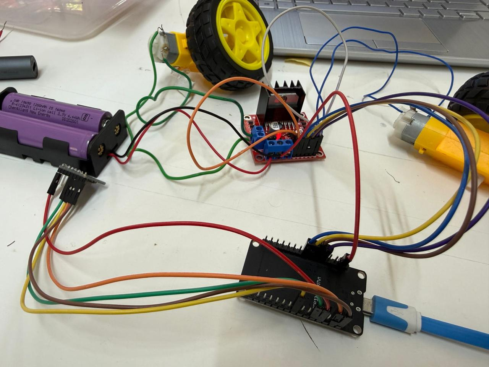

# Self-Balancing Robot — PID Control Prototype

A two-wheeled self-balancing robot prototype built using an Arduino UNO, MPU6050 IMU, L298N motor driver and PID-based feedback control.

> **Project status:** Prototype / experimental  
> The system demonstrated active motor correction and partial stabilization during testing, but sustained autonomous balancing was not fully achieved.

---

## Overview

The objective of this project was to develop a two-wheeled robot capable of correcting its tilt using sensor feedback and closed-loop control.

The robot uses an MPU6050 inertial measurement unit to estimate its tilt angle. This angle is compared with a predefined upright setpoint, and a PID controller generates a correction signal that determines the direction and speed of the motors.

The project involved both hardware integration and iterative controller tuning.

---

## System Architecture

```text
        MPU6050 IMU
             │
             │ Tilt Angle
             ▼
      ┌───────────────┐
      │ PID Controller│
      └───────┬───────┘
              │
        Correction Output
              │
              ▼
      ┌───────────────┐
      │ Motor Control │
      │   PWM + DIR   │
      └───────┬───────┘
              │
              ▼
       L298N Motor Driver
          │          │
          ▼          ▼
      Left Motor  Right Motor
          │          │
          └────┬─────┘
               ▼
          Robot Motion
               │
               └──────► Tilt changes
                         │
                         └──► Feedback

## Hardware

| Component | Purpose |
|---|---|
| Arduino UNO | Main microcontroller |
| MPU6050 | Tilt/IMU sensing |
| L298N | Dual H-bridge motor driver |
| DC geared motors | Drive the two wheels |
| Two-wheel chassis | Mechanical platform |
| Battery supply | Powers the robot |

## Control Approach

### 1. Tilt Estimation

The MPU6050 accelerometer is used to estimate the robot's tilt angle.

The angle is calculated from the accelerometer readings using:

```cpp
angle = atan2(ay, az) * 180.0 / PI;

```

### 2. Error Calculation

The measured angle is compared with the desired balance setpoint:

```cpp
error = angle - setpoint;
```

### 3. PID Control

The controller calculates a correction output using proportional, integral and derivative terms:

```text
Output = Kp × Error + Ki × Integral + Kd × Derivative
```

The output is constrained to the motor PWM range.

### 4. Motor Control

The controller output determines the direction and speed of the motors. PWM is used to control the motor speed.

A small motor-speed trim was included to compensate for differences between the two motor sides.

### 5. Safety Cutoff

If the robot tilts beyond the defined threshold, the motors are stopped and the integral term is reset.

## Controller Parameters

The recovered prototype code used the following PID parameters during testing:

```cpp
Kp = 35.0;
Ki = 0.0;
Kd = 1.5;
setpoint = -0.75;
```

These values were part of the tuning process and were adjusted experimentally based on the robot's response.

## Testing & Tuning

The robot was tested by monitoring its tilt angle, control error and PID output through the Serial Monitor.

The main parameters adjusted during testing were:

- Proportional gain (`Kp`)
- Integral gain (`Ki`)
- Derivative gain (`Kd`)
- Balance setpoint
- Motor-speed trim

The prototype produced corrective motor responses and showed **partial stabilization**, but sustained autonomous balancing was not achieved.

The testing process helped identify the sensitivity of the system to controller parameters, sensor readings, motor response and mechanical alignment.

## Build Photos

### Robot Prototype


### Robot Build


### Electronics and Wiring



## Code

The Arduino UNO control prototype is included in:

`self_balancing_pid_prototype.ino`

The code implements:

- MPU6050 interfacing
- Accelerometer-based tilt estimation
- PID feedback control
- Integral anti-windup
- PWM motor control
- Motor direction control
- Motor-speed trim
- Tilt safety cutoff
- Serial monitoring for tuning

## Engineering Concepts

This project provided hands-on experience with:

- Embedded C/C++ programming
- Arduino UNO programming
- MPU6050 IMU interfacing
- I²C communication
- Feedback control systems
- PID control
- PWM motor control
- H-bridge motor driving
- Closed-loop control
- Controller parameter tuning
- Hardware debugging
- Mechanical and electrical integration

## Project Outcome

The project was developed as a physical control-system prototype.

During testing, the robot produced active corrective motor responses and achieved periods of partial stabilization. However, sustained autonomous balancing was not fully achieved.

The project provided practical experience in implementing a closed-loop control system on physical hardware and debugging the interaction between sensor measurements, controller parameters, motor response and mechanical behavior.

## Future Improvements

- Implement sensor fusion for more robust tilt estimation
- Characterize individual motor response and compensate for differences
- Improve mechanical alignment and chassis rigidity
- Perform more systematic PID tuning
- Improve power distribution and wiring
- Add data logging for controller response analysis
- Evaluate the system under different operating conditions
